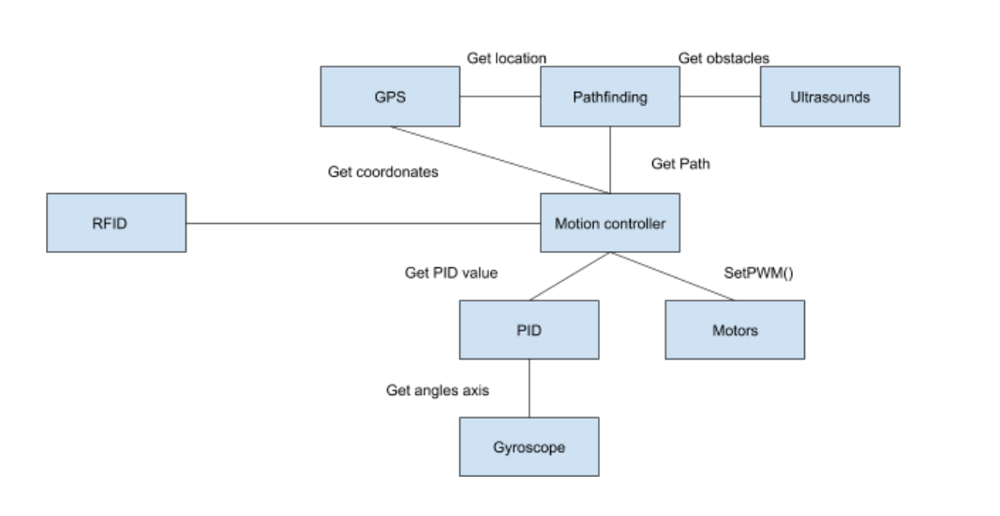

# FIJJJAL
Drone project for ECAM Brussels school. 
All Documentation is written in Markdown, please check the repository [Github](https://github.com/JonathanPetit/FIJJJAL) for a better reading.

## Project
The project is delivery a package from a point A to a point B. 

The package is secured by a box with an electo-magnet. We use the RFID technology to control the box. 

The motor are controlled by a PID regulator and a motion controller to move the drone. The PID use a Gyroscope to regulate the motors.

The drone include a GPS module to locatate it. It have also a Pathfinding code to find a way to delivery the package. 

To detect obstacles, the drone have four ultrasound sensor. When it detect an object, it communicate with the pathfinding module to find an other path. 

Please check each module (table of contents) to have more informations about the drone.

## Structure of the project

## Makers
Julien BEARD  
Fatine BEN MOUSSA  
Maxime DESAINTJEAN  
Ilias EL ABBASSI  
Ludovic MEREL  
Adrien PETIT  
Jonathan PETIT  

## Table of contents
[RFID](./rfid/readme.md)  
[PID regulator](./pid/README.md)  
[GPS](./gps/README.md)  
[Pathfinding](./pathfinding/README.md) 
[Motion Controller](./motionController/README.md) 
[Motor](./motor/README.md) 
[Ultrasound](./ultrasound/README.md) 
[Gyroscope](./gyro/README.md) 