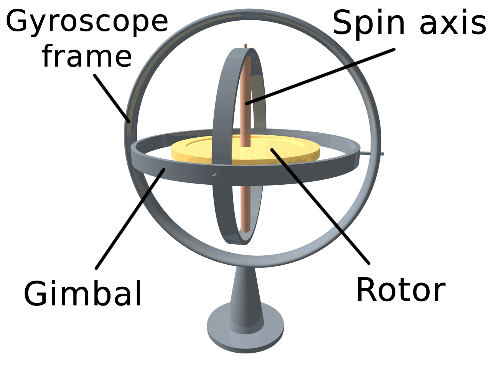

# Gyroscope

A commun gyrscope is a device used for measuring or maintaining orientation and angular velocity.It is a spinning wheel or disc in which the axis of rotation (spin axis) is free to assume any orientation by itself. When rotating, the orientation of this axis is unaffected by tilting or rotation of the mounting, according to the conservation of angular momentum.  

In electronic we use gyro sensors, also known as angular rate sensors or angular velocity sensors, are devices that sense angular velocity.

Vibration gyro sensors sense angular velocity from the Coriolis force applied to a vibrating object.
Here an example Epson 's double-T structure crystal element.

## L3G4200D

The L3G4200D is a triple axis gyroscope. Which means that it captures the angular velocity in the 3 directions.

## Datasheet

 - Supply : 2,7 à 6,5 Vcc
 - Communication protocol : I2C (until 400 kHz) or SPI (10 MHz)
 - Dimensions : 21,6 x 20,3 mm

 For more informations the complete datasheet here (https://www.generationrobots.com/media/ModuleGyroscope27911/27911-L3G4200D-Gyroscope-Manufacturer-Datasheet.pdf)

## Code
 
 
to run : 

- g++ -o gyro *.cpp

- ./gyro

## Author
* **Adrien Petit** - *Initial work* - [adrienpetit](https://github.com/adrienpetit)
* **Jonathan Petit** - *Help to write code* - [JonathanPetit](https://github.com/JonathanPetit)